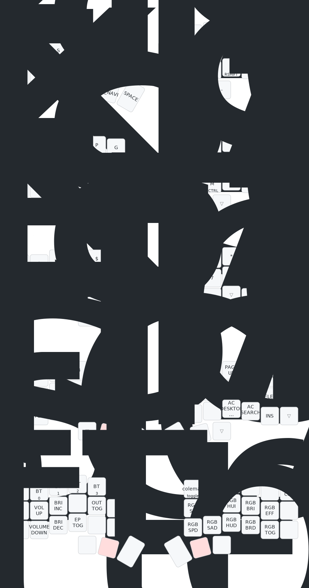

# ZMK Corne Keyboard Layout

This this my personal [zmk](https://github.com/zmkfirmware/zmk) config for my
[corne keyboard](https://github.com/foostan/crkbd), the firmware is built to
work with the following devices.

- Keyboard: Corne 6 column
- Controller: nice!nano v2 + nice!view (for both left and right keyboard)
- Dongle: Seed Xiao nRF52840

> This is a dongle setup with zmk studio support. Left and Right keyboard both
> acts as peripheral and seed xiao as the main controller. This increases the
> battery life of the left board compared to when it is used as both main and
> left peripheral.

## The Keyboard

> Nice!view shield is courtesy of
> [M165437's nice-view-gem](https://github.com/M165437/nice-view-gem).

## Keymaps

These are the keymaps and layers defined in this config. The keymaps were
generated using
[Nick Coutsos's Keymap Editor](https://nickcoutsos.github.io/keymap-editor/).

