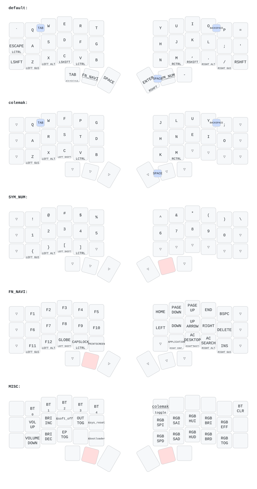

# ZMK Corne Keyboard Layout

This this my personal [zmk](https://github.com/zmkfirmware/zmk) config for my
[corne keyboard](https://github.com/foostan/crkbd), the firmware is built to
work with the following devices.

- Keyboard: Corne 6 column
- Controller: nice!nano v2 + nice!view (for both left and right keyboard)
- Dongle: Seed Xiao nRF52840

> This is a dongle setup with zmk studio support. Left and Right keyboard both
> acts as peripheral and seed xiao as the main controller. This increases the
> battery life of the left board compared to when it is used as both main and
> left peripheral.

## The Keyboard


> Nice!view shield is courtesy of
> [M165437's nice-view-gem](https://github.com/M165437/nice-view-gem).

## Keymaps

These are the keymaps and layers defined in this config. The keymaps were
generated using
[Nick Coutsos's Keymap Editor](https://nickcoutsos.github.io/keymap-editor/).



## Building Locally

GitHub Actions builds this config on every push, but artifacts expire after 90
days. `build-local.sh` reproduces the same targets on a local machine.

The west workspace deliberately lives outside this repo: the repo root already
contains a `zephyr/` directory (the module manifest), which would collide with
the zephyr project west fetches. The script points the build at `config/` with
`-DZMK_CONFIG`, so nothing is written back into this repo.

### One-time setup (macOS, Apple silicon)

```sh
brew install cmake ninja gperf ccache dtc libmagic

mkdir -p ~/zmk-workspace && cd ~/zmk-workspace
python3 -m venv .venv
.venv/bin/pip install west

git clone --branch v0.3.0 --depth 1 https://github.com/zmkfirmware/zmk.git
.venv/bin/west init -l zmk/app
cd zmk
../.venv/bin/west update
../.venv/bin/west zephyr-export
../.venv/bin/pip install -r zephyr/scripts/requirements-base.txt
```

The ZMK revision above matches `config/west.yml`; keep the two in sync. ZMK
v0.3.0 builds against Zephyr 3.5, which pairs with Zephyr SDK 0.16.3. Only the
ARM toolchain is needed — download `zephyr-sdk-0.16.3_macos-aarch64_minimal.tar.xz`
and `toolchain_macos-aarch64_arm-zephyr-eabi.tar.xz` from the
[sdk-ng releases](https://github.com/zephyrproject-rtos/sdk-ng/releases/tag/v0.16.3)
and unpack both into `~/zephyr-sdk-0.16.3`:

```sh
cd ~ && tar xf ~/Downloads/zephyr-sdk-0.16.3_macos-aarch64_minimal.tar.xz
cd ~/zephyr-sdk-0.16.3 && tar xf ~/Downloads/toolchain_macos-aarch64_arm-zephyr-eabi.tar.xz
```

The SDK's `setup.sh` insists on `wget`. To skip it, register the CMake package
by hand and trim the toolchain list to what was actually unpacked:

```sh
mkdir -p ~/.cmake/packages/Zephyr-sdk
echo "$HOME/zephyr-sdk-0.16.3/cmake" > ~/.cmake/packages/Zephyr-sdk/0.16.3
echo "arm-zephyr-eabi" > ~/zephyr-sdk-0.16.3/sdk_toolchains
```

### Building

```sh
./build-local.sh                  # all targets from build.yaml
./build-local.sh corne_left       # one target
```

The `.uf2` files land in `~/Downloads/zmk-firmware/`. Override the locations
with `OUT_DIR`, `ZMK_WORKSPACE`, or `ZEPHYR_SDK_INSTALL_DIR` if the defaults do
not fit.
